# Camp Boss PM POC - 驗證報告

> **POC 目標**：驗證不同 Claude agent 可以基於 bd (beads) 進行完全不同 session 但共享 context 的對話，以便共同完成工作

**驗證日期**：2026-01-11
**測試環境**：Paydirt (Deno + tmux + bd CLI + Claude Code)

---

## 📋 命題 (Proposition)

### 核心命題

**不同的 Claude Code agent 實例能夠透過 bd issue tracking 系統協作完成跨 session 的複雜任務**

### 具體要求

1. **Session 隔離**：每個 agent 在獨立的 tmux session 中執行
2. **Context 共享**：透過 bd comments/issues 傳遞資訊
3. **自動化**：透過 hooks 自動觸發 agent spawn/respawn
4. **可重複**：決策-回答-繼續的循環可以重複執行
5. **實用性**：Miner 能真正理解並執行 resume-task

---

## 🔬 測試方法

### 測試架構

```
Paydirt E2E Tests
├── tests/e2e/full-chain.test.ts          # 完整鏈路測試
├── tests/e2e/miner-resume.test.ts        # Resume 流程測試
└── tests/e2e/multi-round-decision.test.ts # 多輪循環測試

Hook Integration
└── hooks/post-tool-use.sh                # 自動化觸發邏輯
```

### 測試執行

```bash
# 執行單一測試
RUN_E2E_TESTS=1 deno test tests/e2e/miner-resume.test.ts --allow-all

# 執行全部 E2E 測試
RUN_E2E_TESTS=1 deno test tests/e2e/ --allow-all
```

### 測試用例

| 測試檔案 | 驗證內容 | 執行時間 | 狀態 |
|---------|---------|---------|------|
| `full-chain.test.ts` | Miner 創建 decision → PM 回答 | 1m42s | ✅ |
| `miner-resume.test.ts` | Decision 關閉 → Miner resume | 36s | ✅ |
| `multi-round-decision.test.ts` | 兩輪決策循環 | 48s | ✅ |

---

## 🧩 原理說明

### 1. Agent 角色定義

| 角色 | 職責 | Session 類型 |
|------|------|-------------|
| **Miner** | 實作任務，遇到問題時創建 decision | 長期互動 session |
| **PM** | 回答 decision 問題，提供決策 | 一次性 `--print` session |

### 2. 通訊協議

#### Issue Labels

- `pd:decision`：標記需要 PM 回答的 decision issue

#### Comment Patterns

```bash
# Miner 創建 BLOCKED comment
BLOCKED: waiting for <decision-id> | resume-task: <task-description>

# PM 回答
ANSWER [priority]: <answer-text>

Reasoning: <explanation>
Source: <source>

# Miner 回應
PROGRESS: <progress-update>
```

### 3. Hook 觸發機制

#### Decision 創建觸發 (Spawn PM)

```bash
# Hook 偵測：bd create --label pd:decision
if echo "$TOOL_INPUT" | grep -qE "bd create.*--label[= ].*pd:decision"; then
  DECISION_ID=$(extract from CLAUDE_TOOL_OUTPUT)
  paydirt prospect pm --claim "$DECISION_ID" --background
fi
```

#### Decision 關閉觸發 (Respawn Miner)

```bash
# Hook 偵測：bd close <decision-id>
if echo "$TOOL_INPUT" | grep -q "bd close"; then
  # 檢查是否為 pd:decision issue
  if [ "$HAS_DECISION_LABEL" = "true" ]; then
    BLOCKED_ISSUE=$(get dependent work issue)
    RESUME_TASK=$(extract from BLOCKED comment)
    paydirt prospect miner --claim "$BLOCKED_ISSUE" --task "$RESUME_TASK" --background
  fi
fi
```

### 4. Claude CLI 配置

#### PM Agent (一次性執行)

```typescript
buildClaudeCommand({
  print: true,                          // 非互動模式
  dangerouslySkipPermissions: true,     // 自主執行
  permissionMode: 'bypassPermissions',  // 無需確認
  prompt: "Answer decision issue <id>", // 透過 stdin 傳入
})
```

#### Miner Agent (互動模式)

```typescript
buildClaudeCommand({
  print: false,                         // 互動模式
  dangerouslySkipPermissions: true,
  task: "Run bd comments add ...",      // 從 resume-task 提取
})
```

---

## 📊 流程圖

### 完整流程：Miner → Decision → PM → Resume

```mermaid
sequenceDiagram
    participant M as Miner Agent
    participant BD as bd (beads)
    participant H as Hook
    participant PM as PM Agent

    Note over M: Phase 1: 遇到問題
    M->>BD: bd create --label pd:decision
    BD-->>M: Created: pd-xxx
    M->>BD: bd dep add work-issue pd-xxx
    M->>BD: bd comments add work-issue<br/>"BLOCKED: waiting for pd-xxx | resume-task: ..."

    Note over H: Hook 偵測 decision 創建
    H->>BD: bd show pd-xxx (檢查 label)
    H->>PM: paydirt prospect pm --claim pd-xxx --background

    Note over PM: Phase 2: PM 處理
    PM->>BD: bd comments pd-xxx (讀取問題)
    PM->>BD: bd comments add pd-xxx "ANSWER [priority]: ..."
    PM->>BD: bd close pd-xxx

    Note over H: Hook 偵測 decision 關閉
    H->>BD: bd show pd-xxx (檢查 dependents)
    H->>BD: bd comments work-issue (提取 resume-task)
    H->>M: paydirt prospect miner --claim work-issue --task "..." --background

    Note over M: Phase 3: Miner Resume
    M->>BD: bd comments add work-issue "PROGRESS: ..."
    M->>M: 繼續實作工作
```



### 多輪決策循環

```mermaid
graph TD
    Start[Miner 開始工作] --> Q1{遇到問題?}
    Q1 -->|是| D1[創建 Decision 1]
    D1 --> PM1[PM 回答 Decision 1]
    PM1 --> R1[Miner Resume]
    R1 --> P1[PROGRESS: Round 1 done]

    P1 --> Q2{遇到新問題?}
    Q2 -->|是| D2[創建 Decision 2]
    D2 --> PM2[PM 回答 Decision 2]
    PM2 --> R2[Miner Resume]
    R2 --> P2[PROGRESS: Round 2 done]

    P2 --> Q3{遇到新問題?}
    Q3 -->|是| D3[創建 Decision N...]
    Q3 -->|否| Done[工作完成]
    Q2 -->|否| Done
    Q1 -->|否| Work[正常實作]
    Work --> Done

    style D1 fill:#ffd700
    style D2 fill:#ffd700
    style D3 fill:#ffd700
    style PM1 fill:#87ceeb
    style PM2 fill:#87ceeb
    style P1 fill:#90ee90
    style P2 fill:#90ee90
```



### Hook 決策樹


---

## 🧪 測試結果

### Test 1: Full Chain (完整鏈路)

**檔案**：`tests/e2e/full-chain.test.ts`

**驗證內容**：
1. Miner 創建 pd:decision issue
2. Hook 自動 spawn PM
3. PM 回答並 close decision
4. Miner session 可 resume

**執行時間**：1m42s

**關鍵輸出**：
```
✓ Miner created decision: pd-xxxx
✓ Hook spawned PM agent
✓ PM closed decision
✓ Miner session available for resume
```

---

### Test 2: Miner Resume (Resume 流程)

**檔案**：`tests/e2e/miner-resume.test.ts`

**驗證內容**：
1. Setup: work issue 有 BLOCKED + resume-task
2. Decision 有 ANSWER
3. Close decision → Hook respawn Miner
4. Miner 執行 resume-task → 加 PROGRESS comment

**執行時間**：36s

**關鍵輸出**：
```
✓ Work issue has BLOCKED + resume-task
✓ Decision issue has ANSWER
✓ Hook triggered (exit code: 0)
✓ Miner respawned in paydirt-pd-xxxx
✓ Miner added PROGRESS comment (11s)
```

**驗證點**：
- Miner 在 11s 內加上 PROGRESS comment
- Comment 格式正確：`[kent] PROGRESS: Decision acknowledged at YYYY-MM-DD`

---

### Test 3: Multi-Round Decision (多輪循環)

**檔案**：`tests/e2e/multi-round-decision.test.ts`

**驗證內容**：
1. Round 1: Decision 1 → PM 回答 → Miner resume → PROGRESS
2. Round 2: Decision 2 → PM 回答 → Miner resume → PROGRESS

**執行時間**：48s

**關鍵輸出**：
```
Round 1:
  ✓ Decision 1 closed (PM answered)
  ✓ Hook triggered Miner respawn
  [16s] ✓ Miner added PROGRESS (round 1)

Round 2:
  ✓ Decision 2 created and answered
  ✓ Hook triggered Miner respawn
  [21s] ✓ Miner added PROGRESS (round 2)

PROGRESS comments: 2
```

**驗證點**：
- 兩個 PROGRESS comment 都存在
- Round 1 完成後，Round 2 可以正常觸發
- 總時間 48s = 16s (Round 1) + 21s (Round 2) + overhead

---

## 🐛 關鍵 Bug 修復

### Bug 1: Hook grep pattern 錯誤

**問題**：`hooks/post-tool-use.sh:70` 使用 `grep "^BLOCKED:"` 但 bd comments 格式是 `[user] BLOCKED:`

**修復**：
```diff
- RESUME_CONTEXT=$(bd comments "$BLOCKED_ISSUE" 2>/dev/null | grep "^BLOCKED:" | tail -1)
+ RESUME_CONTEXT=$(bd comments "$BLOCKED_ISSUE" 2>/dev/null | grep "] BLOCKED:" | tail -1)
```

**影響**：修復前 RESUME_TASK 為空，Miner 無法接收正確任務

---

### Bug 2: resume-task 包含時間戳

**問題**：提取的 resume-task 包含 ` at 2026-01-11 08:21` 後綴

**修復**：
```diff
- RESUME_TASK=$(echo "$RESUME_CONTEXT" | sed -n 's/.*resume-task:[[:space:]]*\(.*\)/\1/p')
+ RESUME_TASK=$(echo "$RESUME_CONTEXT" | sed -n 's/.*resume-task:[[:space:]]*\(.*\)[[:space:]]at[[:space:]][0-9].*$/\1/p')
```

**影響**：修復前 Miner 會執行 `bd comments add pd-xxx 'PROGRESS: ...' at 2026-01-11`（錯誤）

---

### Bug 3: PM 無法在 tmux 背景執行

**問題**：PM Agent 需要互動式 terminal，tmux detached session 會報錯

**修復**：
```typescript
// src/paydirt/claude/command.ts
if (print) {
  args.push('--print');  // 非互動模式
}

// src/paydirt/cli/prospect.ts
const isOneShotAgent = prospectRole === 'pm';
print: background && isOneShotAgent,
```

**影響**：修復前 PM Agent 無法 spawn，測試會 timeout

---

## ✅ 驗證結論

### 命題驗證結果

| 要求 | 驗證方式 | 結果 |
|------|---------|------|
| **Session 隔離** | tmux session ID 檢查 | ✅ 每個 agent 獨立 session |
| **Context 共享** | bd comments 內容檢查 | ✅ Miner 讀取 PM 的 ANSWER |
| **自動化** | Hook exit code 檢查 | ✅ Hook 成功執行 (exit 0) |
| **可重複** | 多輪測試驗證 | ✅ Round 1 → Round 2 成功 |
| **實用性** | PROGRESS comment 檢查 | ✅ Miner 正確執行 resume-task |

### 性能指標

| 指標 | 數值 | 說明 |
|------|------|------|
| PM 回答時間 | ~30-40s | Spawn → 回答 → Close |
| Miner resume 時間 | ~11-21s | Respawn → PROGRESS comment |
| 單輪循環 | ~36s | Decision → PM → Resume |
| 雙輪循環 | ~48s | 兩次完整循環 |

### 可靠性

- **測試穩定性**：3 個測試全部通過，多次執行結果一致
- **錯誤處理**：Hook 在 issue 不存在時正確返回
- **資料完整性**：bd comments 正確記錄所有互動

---

## 🎯 下一步驗證建議

### P1: 真實實作任務 ✅

驗證 Miner 不只是加 comment，而是真的寫 code 並 commit

#### Stage 1: 純文字檔案 (已完成)

**測試檔案**：`tests/e2e/real-implementation.test.ts`

**測試設計**：
```typescript
resume-task: "Create src/hello.txt with 'Hello from Miner'. Git commit."
驗證: file exists + content correct + git commit + PROGRESS comment
```

**執行結果** (2026-01-11)：
- ✅ 檔案創建：50s
- ✅ 內容正確：`"Hello from Miner"`
- ✅ Git Commit：`7a36a7d test: add hello.txt`
- ✅ PROGRESS Comment：包含 commit hash
- ⏱️ 總時間：1m5s

**關鍵發現**：
```
PROGRESS: Successfully created src/hello.txt with greeting
'Hello from Miner' and committed changes (commit 7a36a7d)
```

Miner 不僅執行命令，還**理解任務**並智能報告：
- 引用 decision 內容（"Hello from Miner"）
- 提取並報告 commit hash
- 用完整句子總結成果

**下一步**：Stage 2 - TypeScript 函數實作 ✅

#### Stage 2: TypeScript 函數 (已完成)

**測試檔案**：`tests/e2e/real-implementation.test.ts`

**測試設計**：
```typescript
resume-task: "Create src/greet.ts with function greet(name: string): string.
Use format from decision. Git commit."
驗證: TypeScript syntax + type annotations + no 'any' + git commit + PROGRESS
```

**執行結果** (2026-01-11)：
- ✅ 檔案創建：55s
- ✅ TypeScript 語法：完美
- ✅ 型別標註：`name: string`, `: string`
- ✅ 程式碼品質：無 `any` 型別
- ✅ Git Commit：`a9d4210 feat: add greet function`
- ✅ PROGRESS Comment：引用決策並確認
- ⏱️ 總時間：1m24s

**Miner 實作的程式碼**：
```typescript
export function greet(name: string): string {
  return `Hello, ${name}!`;
}
```

**品質檢查**：
- ✅ export 關鍵字
- ✅ 函數簽名正確
- ✅ 參數型別標註
- ✅ 返回型別標註
- ✅ Template literals
- ✅ 使用 PM 決策格式
- ✅ 程式碼簡潔優雅

**PROGRESS Comment**：
```
Created src/greet.ts with greet function using format
'Hello, {name}!' as decided in pd-7u09. Committed with git.
```

**關鍵發現**：
1. Miner 能寫出**生產級品質**的 TypeScript 程式碼
2. 僅比純文字檔案慢 19s（1m24s vs 1m5s）
3. 完全遵循型別規範，無 `any` 型別
4. 引用 PM 決策並正確實作格式

**結論**：P1 Stage 2 驗證**真實實作能力** ✅

### P2: Context Exhaustion ✅

驗證 Miner context 耗盡時能自動 respawn 並繼續

**測試檔案**：`tests/e2e/context-exhaustion.test.ts`

**測試設計**：
```typescript
Phase 1: Miner 完成 Task 1 (file1.txt)
Phase 2: Kill session (模擬 context exhaustion)
Phase 3: 從 bd issue 恢復 context，respawn Miner
Phase 4: Miner 完成 Task 2 (file2.txt)

驗證: 兩個檔案存在 + 兩個 PROGRESS comments
```

**執行結果** (2026-01-11)：
- ✅ Task 1 完成：15s
- ✅ Session 中斷：成功
- ✅ Context 恢復：從 bd comments
- ✅ Task 2 完成：15s
- ⏱️ 總時間：35s

**Phase 1 - Initial Work**：
```
PROGRESS: Task 1 done
```
- file1.txt 創建並 commit ✓

**Phase 2 - Session Interruption**：
```
tmux session killed → simulates context exhaustion
```
- Session 確認不存在 ✓

**Phase 3 - Context Recovery**：
```
Recovered comments:
[kent] PROGRESS: Task 1 done at 2026-01-11 17:44
```
- bd issue 提供完整 context ✓
- Miner respawn 成功 ✓

**Phase 4 - Continued Work**：
```
PROGRESS: Task 2 done after respawn
```
- file2.txt 創建並 commit ✓
- Miner 知道是 "after respawn" ✓

**關鍵發現**：
1. **bd 作為持久化 context**：成功保存工作進度
2. **Respawn 無延遲**：Session 中斷與恢復幾乎即時
3. **工作延續性**：兩個任務都完成，兩個 PROGRESS comments
4. **Miner 理解 context**：第二個 comment 提到 "after respawn"

**結論**：P2 驗證**Context exhaustion 可應對** ✅

### P3: 錯誤處理

驗證 PM 無法回答、decision 格式錯誤等異常情況

**測試設計**：
```typescript
場景 1: PM 回答 "UNABLE_TO_DECIDE"
場景 2: Decision 沒有足夠資訊
驗證: Miner 正確處理並回報
```

### P4: 多 Agent 協作

驗證 Miner spawn 其他 agent (如 witness 做 code review)

**測試設計**：
```typescript
Miner → create code → spawn witness
Witness → review → add comment
Miner → read review → fix issues
```

---

## 📚 參考資料

### 相關檔案

```
paydirt/
├── src/
│   ├── paydirt/claude/command.ts      # Claude CLI 命令建構
│   ├── paydirt/cli/prospect.ts        # Agent spawn 邏輯
│   └── types.ts                       # ProspectRole 定義
├── hooks/
│   └── post-tool-use.sh               # Hook 自動化邏輯
├── tests/e2e/
│   ├── full-chain.test.ts            # 完整鏈路測試
│   ├── miner-resume.test.ts          # Resume 測試
│   ├── multi-round-decision.test.ts  # 多輪循環測試
│   ├── real-implementation.test.ts   # P1 真實實作測試
│   └── context-exhaustion.test.ts    # P2 Context exhaustion 測試
└── docs/
    └── poc-camp-boss-pm.md           # 本文件
```

### 關鍵 Commits

- `6d65a63` - fix(pm): enable autonomous PM agent execution in tmux background
- `7aa3cca` - test(e2e): add full chain E2E test proving POC concept
- `a7d86c6` - test(e2e): add Miner resume E2E test proving full decision flow
- `705e1af` - test(e2e): add multi-round decision cycle test
- `54d4ada` - docs: add Camp Boss PM POC verification report
- `1d24ed8` - test(e2e): add P1 real implementation test (Stage 1)

---

**文件版本**：1.2
**最後更新**：2026-01-11 (P1 完成：Stage 1 + Stage 2)
**維護者**：Paydirt Team
